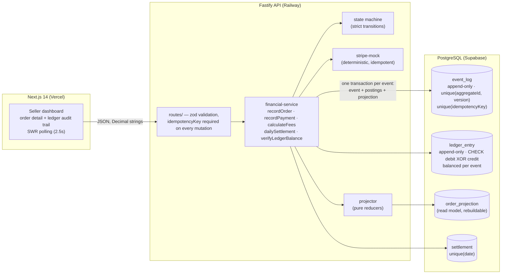

# Seller Ledger — Event-Sourced Order & Payments System

**Submission: Ent-JFE-20/05/26 (Junior Fullstack Engineer)**

A seller takes ~1,000 orders/day. This system records every order **immutably**, processes payments
(mocked Stripe), charges a 3% fee, prevents double payments, supports refunds, runs daily
settlements, and keeps a **double-entry ledger that is balanced at every moment** — with an audit
trail good enough to replay any day and know exactly what happened.

| Deliverable | URL |
| --- | --- |
| Frontend (Vercel) | _fill in after deploy_ |
| Backend API (Railway) | _fill in after deploy_ |
| Database | Supabase (PostgreSQL) |

> Deployment steps: [docs/DEPLOYMENT.md](docs/DEPLOYMENT.md)

---

## Stack

Next.js 14 (App Router) · Fastify 5 · PostgreSQL 16 · Prisma 6 · TypeScript `strict` (both apps) ·
Jest (10 suites / 39 tests) · Tailwind CSS · SWR

## Architecture



**Source of truth is the event log.** Ledger rows and read-model projections are written in the
*same transaction* as their event, and a pure reducer
([projector.ts](backend/src/services/projector.ts)) can rebuild every projection from scratch
(`npm run db:replay`) — that is the "replay the day" requirement, and a test proves the rebuild is
byte-identical to the live read model.

## Guarantees (and where they are enforced)

| Guarantee | Enforced by | Proven by |
| --- | --- | --- |
| Event log append-only | Postgres `BEFORE UPDATE/DELETE` triggers | `ledger-balance.test.ts` |
| Ledger always balanced | one rounded figure posted to both legs, balanced set per event, same tx | `ledger-balance`, `concurrent-orders`, load test |
| Exactly one of debit/credit, positive | `CHECK` constraints in the DB itself | `ledger-balance.test.ts` |
| No double payments | state machine + `unique(aggregateId, version)` optimistic concurrency | `concurrency`, `state-machine` |
| Idempotency (same key ⇒ same result) | `unique(idempotencyKey)` + replay-with-intent-check | `idempotency.test.ts` |
| Settlement runs once per day | `unique(settlement.date)` + aggregate `settlement:<date>` v1 | `settlement.test.ts` |
| Decimal precision exact | `DECIMAL(18,4)` + decimal.js everywhere; amounts are strings on the wire | `decimal-precision.test.ts` |
| Read model never drifts | projections updated in event's own tx; rebuildable by shared reducer | `projection-consistency.test.ts` |

Deep dives: [docs/ARCHITECTURE.md](docs/ARCHITECTURE.md) ·
[docs/CONCURRENCY.md](docs/CONCURRENCY.md) ·
[docs/FINANCIAL_RULES.md](docs/FINANCIAL_RULES.md) ·
[docs/CODE_REVIEW.md](docs/CODE_REVIEW.md) (Part D)

## Ledger design (short version)

Five accounts, four posting rules, one reversal rule — every set balances by construction:

| Event | Debit | Credit |
| --- | --- | --- |
| OrderCreated | `order_balance` (amount) | `order_pending` (amount) |
| PaymentConfirmed | `payment_received` (amount) | `order_balance` (amount) |
| FeeCalculated | `fees_owed` (3%) | `payment_received` (3%) |
| SettlementProcessed | `seller_payout` (amount − fee) | `payment_received` (amount − fee) |
| OrderRefunded | exact reversals of the first three rows | — |

After a full $100 lifecycle: `fees_owed` +3.00, `seller_payout` +97.00, everything else nets to 0,
and Σdebits = Σcredits = $300 for the order. `GET /verify-ledger/:id` recomputes this from raw
rows at any time.

## Concurrency strategy (short version)

No row locks. Two unique constraints do all the work:

- `unique(aggregateId, version)` — every writer reads the current version and inserts `version+1`;
  under a race Postgres lets exactly one INSERT through, the loser gets `409 VERSION_CONFLICT`.
- `unique(idempotencyKey)` — a retry (same key) can only ever *find* the original event; the
  service replays the stored outcome after verifying the request parameters match.

The payment flow is a mini-saga (`processing → charge → confirmed → fees`), each step idempotent
on a key derived from the caller's key, so a crash or Stripe outage at *any* point resumes — never
re-charges. Details and the full race matrix: [docs/CONCURRENCY.md](docs/CONCURRENCY.md).

### Measured under load (Part C.1)

Local run (Windows laptop, portable PostgreSQL 16, `npm run load-test`):

```
create     1020/1020 ok in 3.5s (293 req/s) p50=295ms p95=637ms   ← 1,000 orders + 20 duplicate keys
pay        1000/1000 ok in 8.2s (122 req/s) p50=818ms p95=931ms   ← full saga incl. mock Stripe latency
settle     1000 orders, payout 138732885.5341 (second run replays identically)
trial balance: 8000 entries, debits 429070780.0173 = credits 429070780.0173 -> BALANCED
spot check: 25/25 orders individually balanced
```

All 1,000 orders recorded in well under 10 seconds, duplicates collapsed, every cent accounted for.

## Repository layout

```
backend/    Fastify + Prisma API, event store, ledger, tests, scripts
frontend/   Next.js 14 dashboard (mobile-first Tailwind, SWR polling)
docs/       ARCHITECTURE · CONCURRENCY · FINANCIAL_RULES · CODE_REVIEW · DEPLOYMENT
```

## Running locally

Prereqs: Node ≥ 20, PostgreSQL 16 (or `docker compose up -d`, which serves it on port **5433** to
match `backend/.env`).

```bash
# 1. Database (skip if you already have Postgres on 5433)
docker compose up -d
docker compose exec postgres createdb -U postgres ent_jfe_test   # for the test suite

# 2. Backend — http://localhost:4000
cd backend
npm install
npm run db:migrate        # applies migrations (incl. CHECK constraints + append-only triggers)
npm run db:seed           # demo data through the real service layer
npm run dev

# 3. Frontend — http://localhost:3000
cd ../frontend
npm install
npm run dev
```

### Tests & tooling

```bash
cd backend
npm test                  # 10 suites / 39 tests (real Postgres, no mocks of the DB)
npm run load-test         # Part C.1 — 1,000 orders, then verifies the books
npm run db:replay         # rebuild read model from the event log, report drift
```

## API

All mutation bodies require `idempotencyKey` (or an `Idempotency-Key` header). All amounts are
decimal **strings** (`"100.00"`); responses use fixed 4-dp strings (`"100.0000"`).

| Method | Path | Purpose |
| --- | --- | --- |
| POST | `/orders` | Record an order (OrderCreated + opening postings) |
| POST | `/orders/:id/pay` | Payment saga: processing → mock Stripe → confirmed → 3% fee |
| POST | `/orders/:id/ship` / `:id/deliver` | Fulfillment transitions (no money movement) |
| POST | `/orders/:id/refund` | Balanced reversal of all postings (pre-settlement only) |
| GET | `/orders` · `/orders/:id` | List / detail + full event history |
| GET | `/orders/:id/ledger` | Audit trail: debits, credits, running balance, totals |
| POST | `/settle` | Daily settlement for a UTC date (idempotent per date) |
| GET | `/settlements` | Settlement history |
| GET | `/verify-ledger/:id` | Per-order invariant: Σdebits − Σcredits = 0 |
| GET | `/trial-balance` | The same invariant over the entire ledger |
| GET | `/summary` | Dashboard headline numbers |
| GET | `/health` | Liveness |

Errors share one envelope: `{ "error": { "code", "message", "details?" } }` with codes
`VALIDATION_ERROR` 400, `CARD_DECLINED` 402, `NOT_FOUND` 404, `VERSION_CONFLICT` /
`INVALID_TRANSITION` 409, `IDEMPOTENCY_CONFLICT` 422, `STRIPE_ERROR` 502.

### Simulating failures (mock Stripe)

Customer ids ending in `_declined` / `_insufficient` are declined (402, terminal);
`_unavailable` simulates a Stripe outage (502, retry **with the same key** resumes the saga).

## Frontend

- **Order Status Card** (B.1): amount / 3% fee / payout, lifecycle progress, charge id, settlement
  state, live "ledger balanced ✓" check — polled every 2.5s.
- **Ledger Audit Trail** (B.2): every debit/credit with the causing event, exact 4-dp amounts in
  monospace, running balance per row, totals footer, per-account nets.
- Mobile-first Tailwind (tables collapse to cards), TypeScript strict, zero UI libraries.
- Buttons mint **one idempotency key per action** and reuse it until success — double-clicks and
  retries after the simulated outage demonstrably never double-charge.
