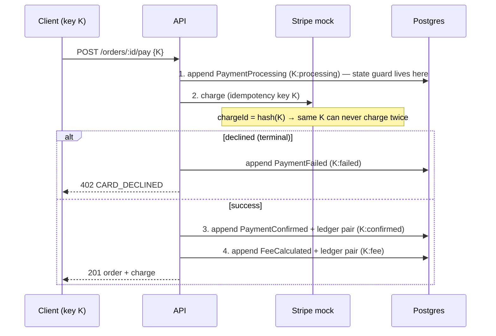

# Architecture

## Why event sourcing (and where we deliberately stop)

The brief demands: immutable records, audit trail, "replay the day", idempotency, and a ledger
that always balances. That set of requirements *is* event sourcing — the question was how much
ceremony to adopt. Decisions:

- **EventLog is the single source of truth.** Every state change is an event appended inside a
  transaction. Nothing ever updates or deletes an event (database triggers physically forbid it).
- **Projections are synchronous.** `order_projection` is updated in the *same transaction* as the
  event append. A queue/outbox would add eventual consistency and infrastructure for zero benefit
  at 1,000 orders/day — and the dashboard must not show numbers the event log doesn't back.
  The cost (slightly larger transactions) is measured and acceptable (see load test in README).
- **No framework.** The event store is ~120 lines on two unique constraints. Understanding every
  line beats configuring a black box, and the failure modes are plain Postgres errors.

## Aggregates

| Aggregate | aggregateId | Events |
| --- | --- | --- |
| Order | `ord_*` | OrderCreated, PaymentProcessing, PaymentConfirmed, PaymentFailed, FeeCalculated, OrderShipped, OrderDelivered, OrderRefunded |
| Settlement | `settlement:<YYYY-MM-DD>` | SettlementProcessed (always version 1 — one per date) |

`PaymentFailed` and `OrderRefunded` extend the brief's minimum event list: the problem statement
requires refund handling, and a payment mock with declines needs a terminal failure event.
`SettlementProcessed` carries the full per-order breakdown in its payload so a replay can
reconstruct settlement marks without consulting any mutable table.

## The payment saga

`POST /orders/:id/pay` is four idempotent steps, each in its own transaction, keyed off the
caller's idempotencyKey `K`:



Why split instead of one big transaction? **The Stripe call cannot be inside a DB transaction**
(external I/O while holding locks/long transactions is how systems melt down). Splitting creates
partial-failure windows — which the derived idempotency keys close: a retry with the same `K`
replays completed steps (`K:processing` exists → returned as-is) and executes the missing ones.
Crash after the charge but before step 3? Retry: step 1 replays, step 2 returns the *same*
chargeId (pure function of `K`), step 3 runs fresh. Money moves exactly once.

The price of this design, stated honestly: between steps the order is briefly `PAID` without fees
calculated. Step 4 follows within milliseconds, fees are recalculated on retry, and settlement
only includes orders **with** fees — so the window is harmless and observable rather than hidden.

## Read model & replay

- `projector.ts` holds **pure reducers** — `(state, event) → state` with no I/O. The same code
  runs in three places: nowhere (live writes set projections explicitly inside the service
  transaction, kept trivially in sync by the version guard), the rebuild script, and the
  projection-consistency test that proves `fold(event_log) === order_projection` field-by-field
  after a messy day (payments, declines, refunds, settlement).
- `npm run db:replay` reconciles, `npm run db:replay -- --write` repairs from events. Events are
  never touched: if the read model and the log disagree, the log wins by definition.

## A.1 design questions, answered

**Why Decimal(18,4)?** Money must be exact base-10. Binary floats cannot represent 0.1, and
errors compound over thousands of postings (a failing demonstration lives in
`decimal-precision.test.ts`). 4 decimal places keep sub-cent intermediate values exact — a 3% fee
on $0.07 is $0.0021, representable without rounding — while 14 integer digits give headroom of
tens of trillions, far beyond any realistic volume. The pair (exactness, fixed scale) also makes
equality and `SUM()` in SQL trustworthy, which `verify-ledger` depends on. In JSON and over HTTP,
amounts travel as **strings**, because JSON numbers are IEEE-754 doubles.

**Why a separate ledger table?** A balance column is a *claim*; a ledger is *evidence*. Storing
each movement as paired debit/credit rows means: (1) the invariant Σdebits=Σcredits is checkable
mechanically at any scope (order, account, whole system); (2) the audit trail is the data itself,
not a reconstruction; (3) corrections are new rows (refund = reversal), never edits — matching
how accountants have handled mistakes for centuries; (4) concurrent writers append rather than
contend on one hot balance row. The projection still carries convenience figures, but they are
derived, never authoritative.

**Why idempotencyKey?** Networks fail *after* the server commits: the client times out, sees an
error, retries — and without idempotency the customer pays twice. A unique key per logical
operation turns "at-least-once delivery" into "exactly-once effect": the first request appends
the event, every retry finds the key and gets the stored outcome back. Two refinements worth
noting: reusing a key with **different parameters** is rejected (`422 IDEMPOTENCY_CONFLICT`)
instead of silently returning the old result, and the saga derives sub-keys (`K:confirmed`,
`K:fee`) so even *partial* progress is resumable.

**Why version as integer?** A dense per-aggregate sequence (1, 2, 3…) is simultaneously: the
optimistic-concurrency token (`unique(aggregateId, version)` — two writers, one winner, loser
gets 409); the total order of events within an aggregate for replay (no clock-skew ambiguity —
timestamps are for humans, versions are for machines); and a gap detector (missing version =
corruption). UUIDs can't be compared, and timestamps collide at millisecond resolution under
exactly the concurrency this system is designed for.

## Module map (backend)

```
src/
  config.ts                 env validation (zod) — fail fast on misconfiguration
  lib/
    money.ts                Decimal helpers; THE one rounding point (fee, half-up, 4dp)
    errors.ts               AppError hierarchy → consistent HTTP envelope
    prisma.ts, ids.ts
  domain/
    state-machine.ts        allowed transitions + next status (single source of truth)
    events.ts               typed payloads (amounts as strings)
  services/
    event-store.ts          appendEvent, withIdempotentEvent (replay machinery)
    ledger.ts               posting validation: XOR sides, >0, balanced set
    financial-service.ts    recordOrder/recordPayment/calculateFees/dailySettlement/
                            verifyLedgerBalance + saga + refund + fulfillment
    projector.ts            pure reducers (live model ≡ replay)
    stripe-mock.ts          deterministic charge: chargeId = hash(idempotencyKey)
    queries.ts              read-side (list, ledger w/ running balance, summary)
  routes/                   thin handlers: zod parse → service → serialize
  plugins/error-handler.ts  one error envelope for everything
```

## API conventions

- Mutations: `201` on first execution, `200` with `replayed: true` on idempotent replay.
- Amounts: 4-dp decimal strings everywhere; input accepts 0–4 dp, validated by regex before any
  arithmetic; JS `number` inputs are rejected outright.
- Errors: single envelope, machine-readable `code`, no internals leaked on 500s.

## Real-time updates: polling, on purpose

The dashboard polls with SWR every 2.5s (plus revalidate-on-focus). For a seller dashboard a
2.5-second staleness bound is indistinguishable from push, costs one cheap indexed query, works
through every proxy/serverless platform, and needs zero connection state. WebSockets/SSE would
add a long-lived-connection tier to host and secure — the right call at a different scale, and an
easy upgrade later (swap the polling hooks for an event-driven mutate). Stated trade-off, not an
oversight.

## Production next steps (out of scope, acknowledged)

Auth (the brief has none), rate limiting, structured audit exports, partial refunds/captures,
multi-currency, outbox + async projections at higher volume, snapshotting if aggregates ever grow
long, observability (metrics + tracing), and a real PSP integration with webhooks.
